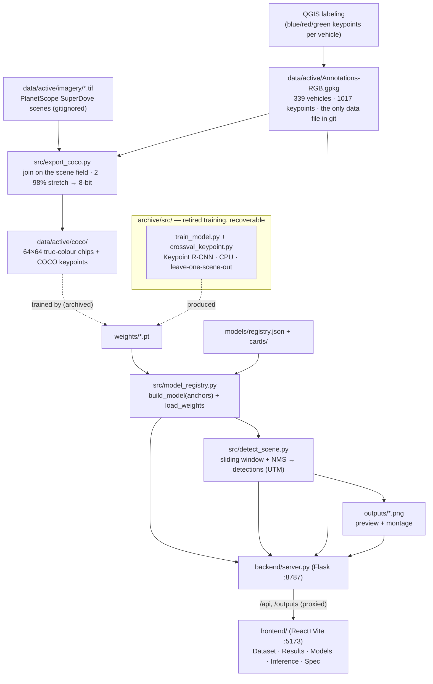

# Architecture — how the system fits together

End-to-end view, from a hand-labeled vehicle to a detection on the web console. **The training approach is being
rebuilt from scratch** — the training scripts were moved to [`../archive/src/`](../archive/) (see
[`../archive/README.md`](../archive/README.md)). Everything else — data export, **inference**, the **model
registry** + weights, and the **full console** — is active; the existing models still run. For the operating
rules see [`../CLAUDE.md`](../CLAUDE.md); for the model reference to rebuild against see [MODELING.md](MODELING.md).

---

## Data flow

The training stage (dashed, in the `archive/` subgraph) is being rebuilt; the weights it already produced stay
in `weights/` and run through the active inference + console path.

---

## Components

### 1. Labels + imagery (`data/`)
- **`data/active/Annotations-RGB.gpkg`** — vehicles labeled in QGIS, 3 keypoints each (blue/red/green), tagged
  with their `scene`. **The only data artifact tracked in git.**
- **`data/active/imagery/*.tif`** — the 8 labeled PlanetScope scenes (gitignored, Planet EDU-licensed).
- **`data/cold/`** — archived unlabeled scenes + the QGIS project (gitignored). (Distinct from `archive/`, which
  holds retired *training code*.)

### 2. Export → COCO + chips (`src/export_coco.py`)
Joins labels to imagery **on the `scene` text field** (never a spatial/extent join — overlapping scenes would
leak labels), renders true colour from bands 6/4/2 with a 2–98 % stretch to 8-bit, and cuts **64×64 chips** with
COCO keypoint annotations into `data/active/coco/`. This is the upstream contract the model consumes.

### 3. The registry (`models/registry.json` + `src/model_registry.py`)
The registry is the **source of truth** for trained models: one entry per model with its architecture (crucially
its **anchor set**, which must match at load time), training config, metrics, notes, and the `active` pointer.
`model_registry.py` rebuilds the correct graph and loads the (gitignored) weights on demand. It is
**self-contained** — active inference depends on it, not on any archived training script.

### 4. Inference (`src/detect_scene.py`)
Slides a 64 px window across a full scene, runs the model (built via `model_registry`), deduplicates with NMS,
and emits detections in UTM plus a preview + montage PNG into `outputs/`. Produces the **full-scene deployment**
numbers (recall / precision / F1) — the real metric, distinct from centered-chip recall.

### 5. Backend (`backend/server.py`, Flask :8787)
Bridges the console to the real model: dataset counts, the scene list, the model registry (list / set-active /
edit notes / read card), and `/api/detect` which runs a chosen model on a scene. Serves generated PNGs from
`/outputs`.

### 6. Frontend (`frontend/`, React + Vite :5173)
Five tabs — **Dataset**, **Results** (cross-validation + full-scene numbers), **Models** (browse / activate /
archive / annotate, view methodology cards), **Inference** (run the active model on a scene), **Spec** (the
annotation contract). Vite proxies `/api` and `/outputs`.

### 7. Training (archived, rebuilding — `archive/src/`)
The retired scripts (`train_model.py`, `crossval_keypoint.py`, `train_keypoint_rcnn*.py`, `viz_heldout.py`,
`infer_keypoints.py`). The reference to rebuild against: Keypoint R-CNN (ResNet-50 + FPN), 64×64 chips, finetuned
from COCO-pretrained, **leave-one-scene-out** eval, anchors `small (8–128)` / `default (32–512)`, best
**full-scene F1 ≈ 0.50** (matches Van Etten's 0.49). See [`../archive/README.md`](../archive/README.md).

---

## The two metrics (don't conflate)

| Metric | Where | What it measures | Ballpark |
|---|---|---|---|
| **Centered-chip recall** | training eval | one 64 px chip centered on each labeled vehicle — "do you recognise it?" | ~0.97 |
| **Full-scene P/R/F1** | Inference tab / `detect_scene.py` | find echoes across a whole raw scene — the deployable task | ~0.40 / 0.68 / 0.50 |

Open items deliberately left for the training rebuild — keypoint correction, the anchor sweep, a production model
on all scenes, threshold calibration, the geometry filter, velocity — are in [REFINEMENT.md](REFINEMENT.md).
