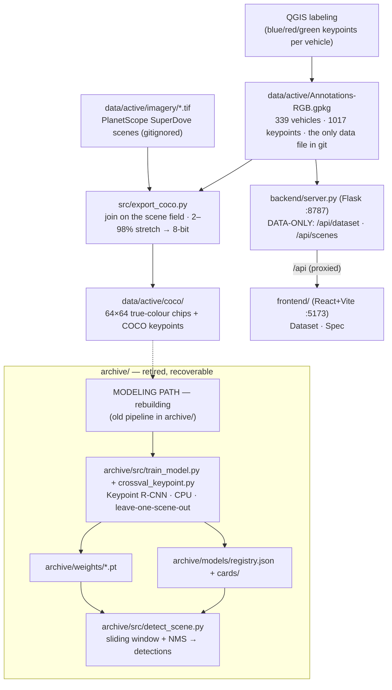

# Architecture — how the system fits together

End-to-end view of the pipeline. **The modeling / training / inference path is being rebuilt from scratch** —
the old pipeline was moved intact to [`../archive/`](../archive/) (see [`../archive/README.md`](../archive/README.md)).
What remains active below is the **data pipeline** (upstream of modeling) plus a **data-only console**. For the
operating rules see [`../CLAUDE.md`](../CLAUDE.md); for the model reference to rebuild against see
[MODELING.md](MODELING.md).

---

## Data flow

Solid arrows are the **active** path; the dashed arrow into the dashed subgraph is where the **rebuilt**
modeling will re-attach. Everything in the `archive/` subgraph is retired reference code.

---

## Active components

### 1. Labels + imagery (`data/`)
- **`data/active/Annotations-RGB.gpkg`** — vehicles labeled in QGIS, 3 keypoints each (blue/red/green), tagged
  with their `scene`. **The only data artifact tracked in git.**
- **`data/active/imagery/*.tif`** — the 8 labeled PlanetScope scenes (gitignored, Planet EDU-licensed).
- **`data/cold/`** — archived unlabeled scenes + the QGIS project (gitignored). (Distinct from `archive/`,
  which holds retired *code*.)

### 2. Export → COCO + chips (`src/export_coco.py`)
Joins labels to imagery **on the `scene` text field** (never a spatial/extent join — overlapping scenes would
leak labels), renders true colour from bands 6/4/2 with a 2–98 % stretch to 8-bit, and cuts **64×64 chips** with
COCO keypoint annotations into `data/active/coco/`. Utilities `inspect_scene.py` (true-colour render) and
`make_road_mask.py` (OSM road mask) sit alongside it. **This is the upstream contract the rebuilt model consumes
— it is correct and unchanged.**

### 3. Backend (`backend/server.py`, Flask :8787) — data-only
Serves the real dataset to the console: `GET /api/dataset` (annotation counts from the GeoPackage) and
`GET /api/scenes` (scene list with per-scene label counts). The model/registry/`/api/detect` endpoints were
archived; re-add them when the new inference pipeline exists.

### 4. Frontend (`frontend/`, React + Vite :5173) — data-only
Two tabs: **Dataset** (live label counts + per-scene coverage) and **Spec** (the annotation contract, rendered
from `frontend/src/docs/annotations-spec.md`). Vite proxies `/api` to the backend. The Results / Models /
Inference tabs were archived with the model-capable console at `archive/frontend/App.tsx`.

---

## The modeling path (archived, to rebuild)

Retired to [`../archive/`](../archive/), fully recoverable. The reference to rebuild against:
Keypoint R-CNN (ResNet-50 + FPN), 64×64 chips, finetuned from COCO-pretrained, **leave-one-scene-out** eval,
anchors `small (8–128)` / `default (32–512)`, best **full-scene F1 ≈ 0.50** (matches Van Etten's 0.49).

Two metrics, never conflated (this discipline carries into the rebuild):

| Metric | What it measures | Ballpark (old pipeline) |
|---|---|---|
| **Centered-chip recall** | one 64 px chip centered on each labeled vehicle — "do you recognise it?" | ~0.97 |
| **Full-scene P/R/F1** | find echoes across a whole raw scene — the deployable task | ~0.40 / 0.68 / 0.50 |

Open items deliberately left for the rebuild — keypoint correction, the anchor sweep, a production model on all
scenes, threshold calibration, the geometry filter, velocity — are in [REFINEMENT.md](REFINEMENT.md).
